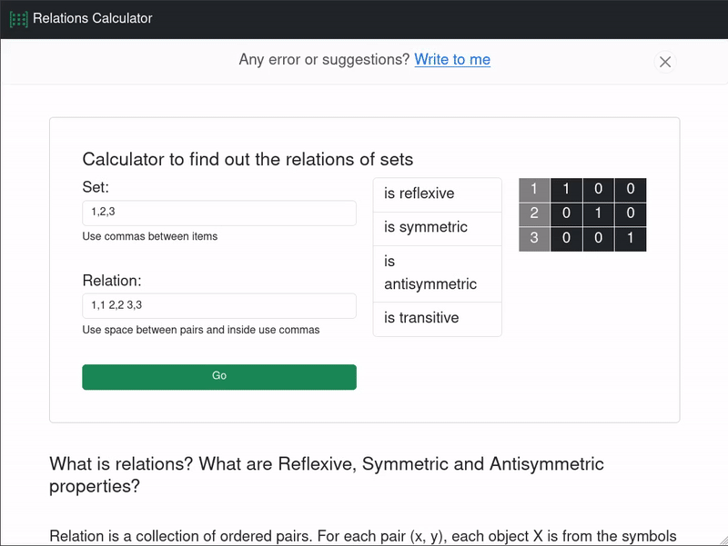

#relCalculator

relCalculator is a tool designed to identify and analyze the relationships within sets, specifically focusing on Reflexive, Symmetric, and Antisymmetric properties. It also provides a matrix representation of these relations for easier visualization.

## What Are Relations? What Are Reflexive, Symmetric, and Antisymmetric Properties?

A relation is a collection of ordered pairs where each pair (x, y) represents a connection between elements. In this context, X is an element from the first set, and Y is an element from the second set.

Relations can also occur within a single set, where both X and Y are from the same set. This scenario is the most common and is key to understanding the relational properties.

In the matrix representation of relations, each row corresponds to an X element, and each column corresponds to a Y element. Each cell in the matrix indicates whether a particular pair (x, y) exists in the relation—marked by a 1 if the pair is present. The set can be composed of symbols, numbers, or any other characters, depending on the context.